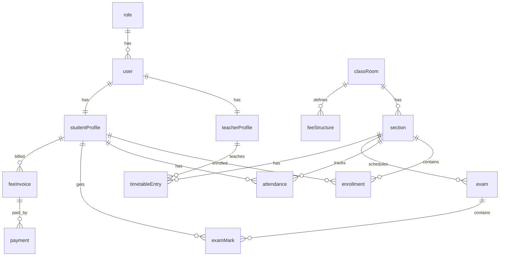

```mermaid
erDiagram
    role ||--o{ user : has
    user ||--|| teacherProfile : has
    user ||--|| studentProfile : has
    classRoom ||--o{ section : has
    studentProfile ||--o{ enrollment : enrolled
    section ||--o{ enrollment : contains
    section ||--o{ attendance : tracks
    studentProfile ||--o{ attendance : has
    section ||--o{ exam : schedules
    exam ||--o{ examMark : contains
    studentProfile ||--o{ examMark : gets
    classRoom ||--o{ feeStructure : defines
    studentProfile ||--o{ feeInvoice : billed
    feeInvoice ||--o{ payment : paid_by
    section ||--o{ timetableEntry : has
    teacherProfile ||--o{ timetableEntry : teaches
```
